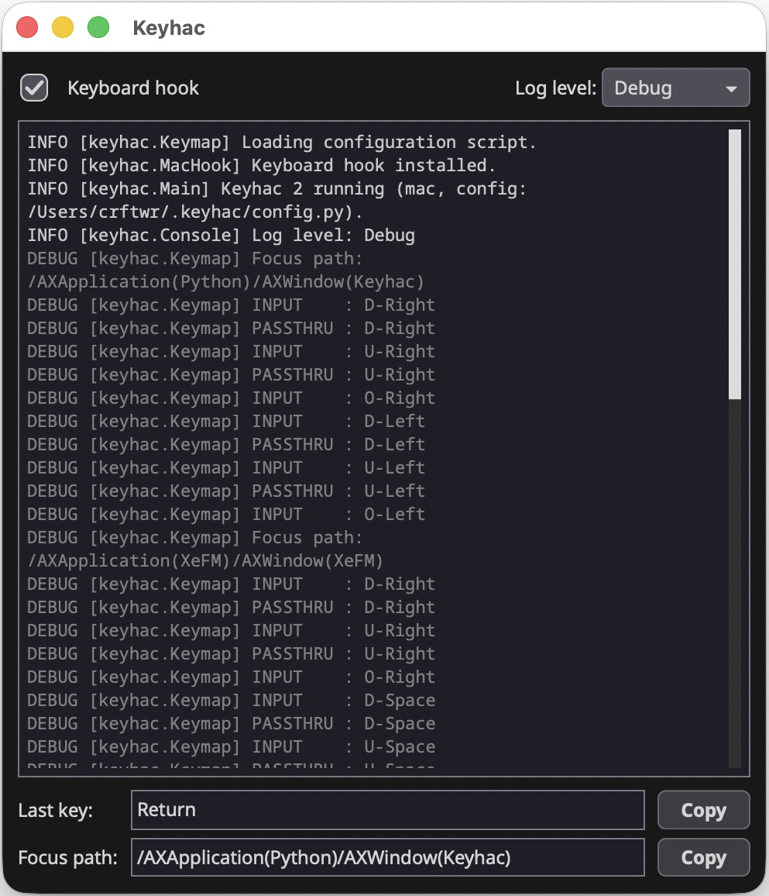
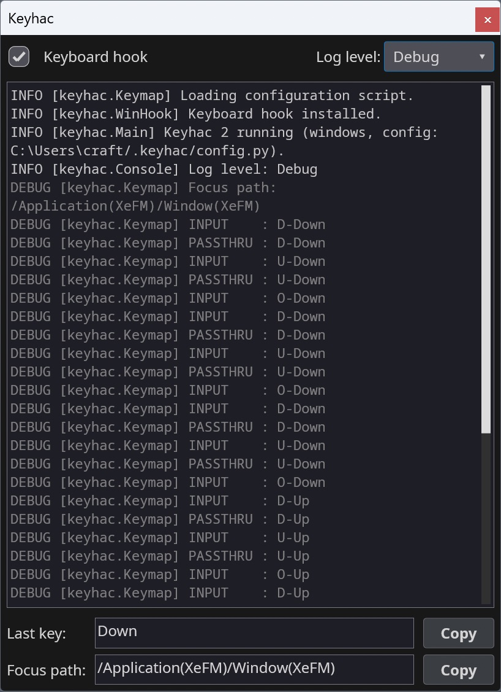
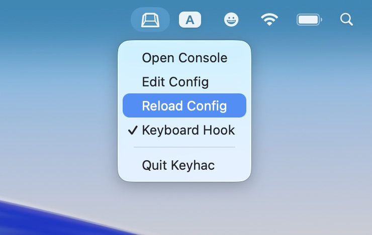
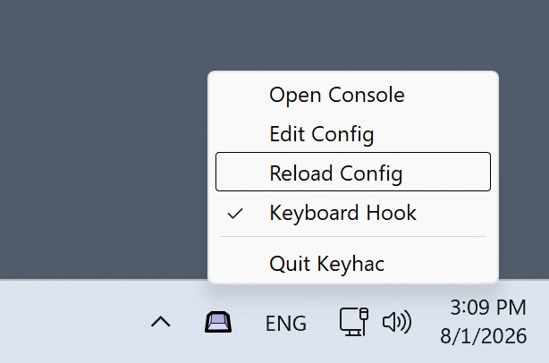

# Keyhac 2

Python-scriptable keyboard customization for **Windows and macOS**.

Keyhac installs a system-wide keyboard hook and lets you script what your keys do in
Python. You write one file, `~/.keyhac/config.py`, and it runs unchanged on both OSes —
remapping keys, binding keys to Python functions, and driving windows, applications and
the clipboard from the keyboard.

<!-- pypi-exclude-start -->
<p>
  <a href="https://apps.microsoft.com/detail/9P8H1PG6PRHH">
    
  </a>
  &nbsp;
  <a href="https://github.com/crftwr/keyhac/releases/latest">
    
  </a>
</p>
<!-- pypi-exclude-end -->

Keyhac 2 replaces the two previous-generation products, Keyhac for Windows (1.x)
and Keyhac for macOS (1.x), rebuilt as one shared codebase. Those older versions
are no longer developed — if you are coming from one of them, see the migration
guides in [Documentation](#documentation) below.
Keyhac 2's UI is built on [PuiKit](https://github.com/crftwr/puikit).

## Features

- **Key remapping**: key → key, key → key sequence, key → Python function.
- **Per-application key tables**: match by app name, window title, Win32 window class,
  or the full accessibility focus path (AX on macOS, UI Automation on Windows) — down to
  "only in this app's text editor pane".
- **User modifiers**: turn any key into a modifier of your own (User0–User3), invisible
  to applications.
- **One-shot modifiers**: tap a modifier alone for one action, hold it to modify.
- **Multi-stroke key tables**: Emacs-style prefix keys, with a balloon showing the
  armed prefix.
- **Clipboard history**: persistent history in a popup chooser — type to filter,
  Enter pastes into the app you came from. Plus fixed snippets and scriptable
  clipboard-transform tools.
- **Window control**: move, snap/tile, minimize, activate and launch applications,
  multi-monitor aware.
- **Keyboard macros**: record and replay keys.
- **Mouse output**: send clicks, wheel scrolls and pointer moves from key bindings.
- **Console window**: live log, last-key and focus-path inspector — see exactly what to
  bind. Runs from the system tray (Windows) / menu-bar extra (macOS).

## Screenshots

| Console (macOS) | Console (Windows) |
|---|---|
|  |  |

| Menu-bar extra (macOS) | Task tray (Windows) |
|---|---|
|  |  |

## Install

- **macOS 15+** — download `Keyhac-<version>-macos.dmg` from
  [Releases](https://github.com/crftwr/keyhac/releases): drag Keyhac.app into
  Applications and launch it. Grant the Accessibility permission when prompted
  (required for the keyboard hook).
- **Windows 10/11 (x64)** — install from the
  [Microsoft Store](https://apps.microsoft.com/detail/9P8H1PG6PRHH)
  (or `winget install --id 9P8H1PG6PRHH --source msstore`) — automatic updates, no
  SmartScreen warning. Alternatively, download `Keyhac-<version>-win64.zip` from
  [Releases](https://github.com/crftwr/keyhac/releases), unzip anywhere and run
  `Keyhac.exe`.

Details, data locations and privacy notes: [doc/installation.md](doc/installation.md).

## Quick start

On first run Keyhac creates `~/.keyhac/config.py` from a fully commented template.
Open it from the tray / menu-bar icon ("Edit Config"), edit, then "Reload Config".
A config defines one function:

```python
from keyhac import *

def configure(keymap):
    kt = keymap.define_keytable(focus_path_pattern="*")   # active everywhere

    kt["Fn-J"] = "Left"                        # key -> key
    kt["Fn-A"] = "Home", "Shift-End"           # key -> sequence

    def hello():                               # key -> Python function
        print("Hello from config.py")
    kt["Fn-H"] = hello

    kt["Fn-V"] = ShowClipboardHistory()        # clipboard history popup

    kt_browser = keymap.define_keytable(app="chrome|Safari")   # per-app table
    kt_browser["Fn-R"] = "Cmd-R"
```

The full reference is [doc/configuration.md](doc/configuration.md); the shipped
template ([keyhac/_config.py](keyhac/_config.py)) is a working tour of every feature.

## Documentation

- [Installation](doc/installation.md) — install, permissions, data files, privacy.
- [Configuration](doc/configuration.md) — the complete config.py reference.
- [Migrating from Keyhac for macOS](doc/migration-from-keyhac-mac.md) — mostly drop-in.
- [Migrating from Keyhac for Windows](doc/migration-from-keyhac-win.md) — API renamed;
  translation table.
- Legacy products (no longer developed, kept for reference):
  [Keyhac for Windows 1.x](https://github.com/crftwr/keyhac-win),
  [Keyhac for macOS 1.x](https://github.com/crftwr/keyhac-mac).
- [Developer documentation](doc/dev/) — architecture, platform layer, packaging,
  testing. Project guide for coding agents: [CLAUDE.md](CLAUDE.md).

## Running from source

```sh
python3 -m venv .venv
.venv/bin/pip install -e ".[dev]"
.venv/bin/python -m pytest          # engine + unit tests, no permissions needed
.venv/bin/python -m keyhac          # run (macOS: needs Accessibility permission)
```

`python -m keyhac -d` enables debug logging, `--no-ui` runs headless (hook + engine
only), `--config PATH` uses an alternate config file (its data files live beside it).

## Contact & Support

- **GitHub Issues**: [Report bugs or request features](https://github.com/crftwr/keyhac/issues)
- **PyPI**: [pypi.org/project/keyhac](https://pypi.org/project/keyhac/) — released versions
- **Author's X (Twitter)**: [@crftwr](https://x.com/crftwr)

## License

MIT — see [LICENSE](LICENSE).
